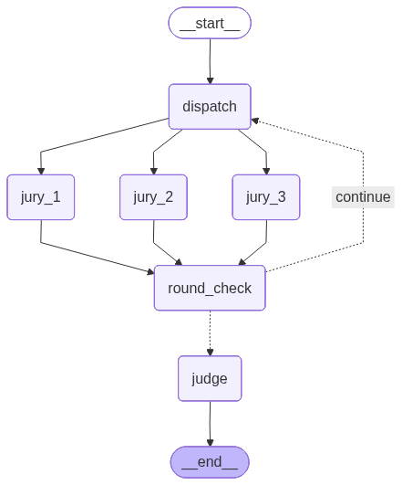

# ⚖️ LangGraph AI Jury & Judge Debate System

Bu proje, **LangGraph** ve **Tavily (Web Search)** kullanılarak geliştirilmiş, çoklu otonom ajanın (Multi-Agent) belirli bir konuyu araştırıp kendi aralarında münazara ettiği (Debate) akıllı bir karar destek sistemidir. 

Kullanıcının girdiği konu üzerine **3 farklı jüri ajanı** farklı perspektiflerden (Resmi/Tarihi, Sosyal Medya/Kamuoyu, Akademik/Bilimsel) web araştırması yapar. Ajanlar 3 tur boyunca tez ve anti-tezler üreterek birbirlerinin argümanlarını çürütmeye çalışır. Sürecin sonunda **Judge Agent (Yargıç Ajan)**, tüm tartışma geçmişini sentezleyerek nihai bir karar verir ve jüri üyelerini performanslarına göre 1-10 arası puanlar.

> 📖 **Projenin teknik mimarisini, LangGraph döngülerini ve otonom ajanların nasıl çalıştığını tüm detaylarıyla anlattığım Medium makalemi okuyabilirsiniz:**
> [LangGraph ile Münazara Yapan Agent'lar: Jüri Agent'ları ve Judge Agent Mimarisi](https://medium.com/@metehansaribas001/langgraph-ile-m%C3%BCnazara-yapan-agentlar-j%C3%BCri-agentlar%C4%B1-ve-judge-agent-mimarisi-d404b1b5522c)

## 🧩 Sistem Mimarisi ve İşleyiş Haritası

Aşağıdaki şema, kullanıcı isteğinin ajanlara nasıl dağıtıldığını (Fan-Out), argümanların nasıl birleştirildiğini (Fan-In) ve koşullu döngülerle (Conditional Edges) sürecin nasıl yargıca bağlandığını göstermektedir.



### ⚙️ Çalışma Akışı
1. **Dispatcher (Dağıtıcı):** Kullanıcı bir konu girer. Soru paralel (eşzamanlı) olarak 3 farklı Juri (Jury) Agent'a iletilir.
2. **Jury Agent'lar (ReAct System):** Her jüri, kendi sistem prompt'unda belirtilen kimliğe bürünür. Tavily arama motorunu kullanarak web üzerinde canlı araştırma yaparlar ve `Structured Output (Pydantic)` ile **Tez, Anti-Tez, Gerekçeler ve Kaynaklar** üretirler.
3. **Round Checker & Conditional Edge:** Her tur bitiminde jürilerin verdikleri yanıtlar ortak hafızada (`State`) kalıcı olarak birleştirilir. Sistem 3 tam tura ulaşana kadar ajanları birbiriyle tartıştırmaya (Döngü/Loop) devam eder. Sonraki turlarda ajanlar, hafızaya bakarak bir önceki turun argümanlarını çürütmeyi dener!
4. **Judge Agent (Yargıç):** Tartışma 3. turun sonuna geldiğinde yönlendirici kapı (router), akışı Yargıç Ajanına çevirir. Yargıç tüm geçmişi okur, bağlamı oluşturur, son kararını verir ve sürece olan katkılarına göre jürileri puanlar. Ortaya tek ve yapılandırılmış bir "Nihai Karar" çıkar.

## 🚀 Teknolojiler
* **[LangGraph](https://python.langchain.com/docs/langgraph/):** Ajan akışını, durum (state) yönetimini ve döngüsel mantığı kurgulamak için.
* **[LangChain](https://python.langchain.com/):** Otonom araç (Tavily) kullanımını ve ReAct zincirini oluşturmak için.
* **[Tavily Search API](https://tavily.com/):** Yapay zeka ajanlarının kesintisiz dış dünya (İnternet) bağlantısı ve araştırma yeteneği için.
* **[OpenAI (GPT-4o & GPT-4o-Mini) API](https://platform.openai.com/):** LLM beyni. 
* **[Pydantic](https://docs.pydantic.dev/):** Ajanların çıktılarını mükemmel, yapılandırılmış (%100 garantili JSON) formatlara sokmak için.
* **[Streamlit](https://streamlit.io/):** Süreci saniye saniye görselleştiren canlı, kolay ve dinamik web arayüzü için.
* **[uv](https://github.com/astral-sh/uv):** Şimşek hızında ve güvenli Python paket/ortam yönetimi.

## 💻 Kurulum ve Çalıştırma

**1. Depoyu Klonlayın**
```bash
git clone https://github.com/saribasmetehan/LangGraph_Jury-Judge.git
cd LangGraph_Jury-Judge
```

**2. Gerekli Paketleri Yükleyin**
Projede `uv` kullanılmıştır.
```bash
uv sync  # Veya standart pip kullanıyorsanız requirements/dependecies kurun
```

**3. Çevre Değişkenlerini Ayarlayın**
`.env.example` dosyasını ana dizine `.env` olarak kopyalayın ve içerisindeki API anahtarlarını doldurun:
```properties
OPENAI_API_KEY=sk-senin-openai-anahtarin
TAVILY_API_KEY=tvly-senin-tavily-anahtarin
```

**4. Projeyi Ayağa Kaldırın**
Ajanların çalışmasını ve ekranda akmasını anlık takip etmek için terminale şu komutu yazın:
```bash
uv run streamlit run app.py
```
*(Uygulama tarayıcınızda `http://localhost:8501` adresinde başlayacaktır.)*

## 🎬 Uygulama Arayüzü

Tartışma başladığında Streamlit sayesinde ajanların hangi turda çalıştığını, ürettikleri **Tez** ve **Karşıt Görüş** argümanlarını eşzamanlı izleyebilirsiniz. Süreç bittiğinde Yargıcın 3 ayrı renk kodlanmış jüri metrik skorlamasını görüntüleyebilirsiniz.

---
_Yapay zekanın sınırlarını LangGraph ile test ettiğimiz bu projeyle ilgili daha fazla düşünceniz veya merak ettiğiniz detaylar varsa makaleme göz atmayı unutmayın!_
